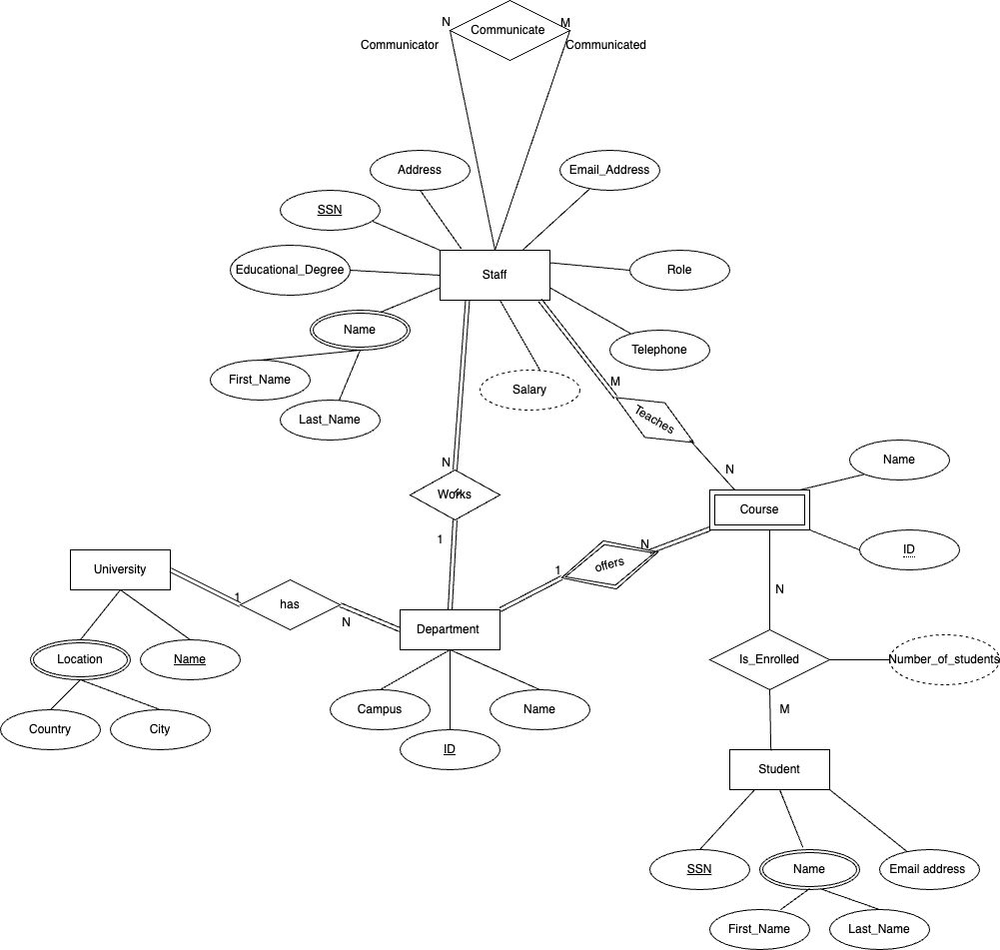
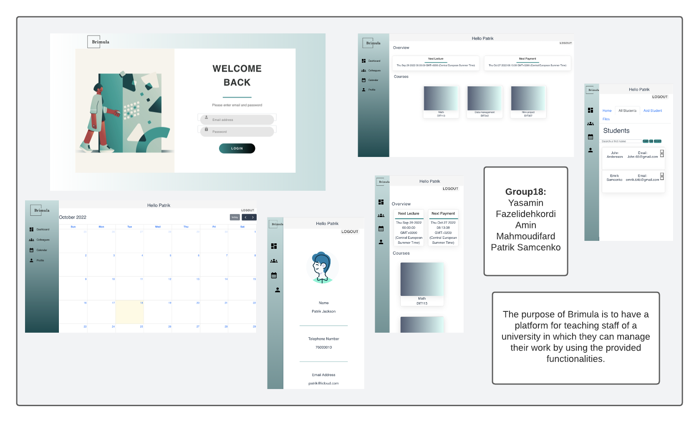

## Visual Studio Code (VSCode)

Open the `server` and `client` in separate VSCode workspaces or open the combined [backend-frontend.code-workspace](./backend-frontend.code-workspace). Otherwise, workspace-specific settings don't work properly.

## System Definition 

### Purpose

The purpose of the system created is intended to be that of a management system for the staff of a university, or another similar institution. As a part of this, the system will allow for appropriate staff to login to their accounts to manage, among others, their personal schedules, courses, and salaries, as well as communicate with their colleagues. Furthermore, the system will facilitate staff managing courses, each of which shall have belonging to it a number of students, relevant text and the possibility of uploading files.

### Pages

* Login: Login with the provided credentials.
* Staff Dashboard: Provides an overview of taught courses, next lecture and salary information.
* Course page: Provides a summary of all the relevant course data, departments and students.
* Colleagues page: Provides a list of collegues in the related department and their contact information.
* Calandar page: Provides a calandar.
* Profile page: Provides the personal information of the person who has logged in.

### Entity-Relationship (ER) Diagram

## Teaser (MS3)

